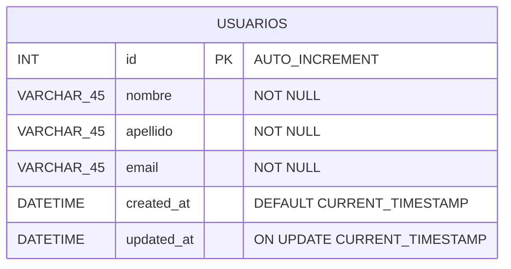

# ERD — esquema_usuarios

```mermaid
erDiagram
    USUARIOS {
        INT id PK "AUTO_INCREMENT"
        VARCHAR_45 nombre "NOT NULL"
        VARCHAR_45 apellido "NOT NULL"
        VARCHAR_45 email "NOT NULL"
        DATETIME created_at "DEFAULT CURRENT_TIMESTAMP"
        DATETIME updated_at "ON UPDATE CURRENT_TIMESTAMP"
    }
```

La aplicación usa una sola entidad, por lo que no existen relaciones entre
tablas. El script reproducible está en
`flask_app/bd/esquema_usuarios.sql`.
