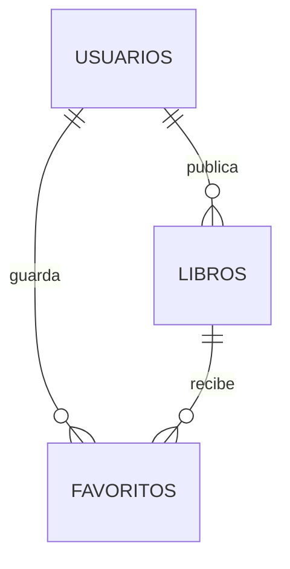

# Documentación técnica de BookHub

## 1. Qué es el proyecto

BookHub es una aplicación web MVC para registrar usuarios, iniciar sesión, publicar libros, explorar las publicaciones de la comunidad y guardar libros como favoritos. El backend está hecho con Flask y PyMySQL; las vistas usan Jinja2, Bootstrap 5, CSS propio y JavaScript sin framework. Los datos se guardan en MySQL.

La aplicación separa sus responsabilidades de esta forma:

```text
Navegador
   │ petición HTTP
   ▼
Controladores Flask ── validan sesión, CSRF y datos
   │
   ├──► Modelos Python ── consultas SQL parametrizadas
   │                         │
   │                         ▼
   │                     MySQL / bookhub_db
   │
   └──► Plantillas Jinja ── HTML + Bootstrap + CSS + JavaScript
```

## 2. Estructura de archivos

```text
bookhub/
├── run.py                         Punto de entrada del servidor Flask
├── .env                           Configuración local privada (ignorada por Git)
├── .env.example                   Plantilla pública de variables de entorno
├── requirements.txt               Dependencias de Python
├── pytest.ini                     Configuración de pytest
├── flask_app/
│   ├── __init__.py                Crea la app, Bcrypt, CSRF y manejadores de error
│   ├── config/
│   │   └── mysqlconnection.py     Adaptador de conexión y ejecución SQL
│   ├── controllers/
│   │   ├── helpers.py             Decorador de login y protección CSRF
│   │   ├── usuarios.py            Registro, login, logout e inicio
│   │   └── libros.py              CRUD, exploración y favoritos
│   ├── models/
│   │   ├── usuario.py             Datos, consultas y validaciones de usuarios
│   │   ├── libro.py               Datos, consultas y validaciones de libros
│   │   └── favorito.py            Relación usuarios-libros favoritos
│   ├── templates/                 Vistas Jinja2
│   └── static/
│       ├── css/style.css          Layout y estilos propios
│       └── js/app.js              Interacciones del navegador
├── resources/
│   ├── database.sql               DDL reproducible de la base de datos
│   ├── bookhub.mwb                Modelo EER nativo de MySQL Workbench
│   ├── ERD.md / ERD.svg / ERD.png Diagrama y documentación visual
│   └── capturas/                  Evidencia visual de la aplicación
└── tests/                          Pruebas de validaciones, seguridad y rutas
```

## 3. Inicio de la aplicación y dotenv

### `run.py`

Importa la instancia `app` y arranca el servidor. El host, puerto y modo de depuración se leen desde el entorno:

- `FLASK_HOST`: interfaz de red; localmente es `127.0.0.1`.
- `FLASK_PORT`: puerto HTTP; por defecto `5000`.
- `FLASK_DEBUG`: activa el depurador únicamente cuando vale `1`.

### `flask_app/__init__.py`

1. `load_dotenv()` carga las variables del archivo `.env`.
2. Se crea `Flask(__name__)`.
3. `SECRET_KEY` firma la cookie de sesión. Si no existe, se genera una clave temporal; en el proyecto local sí está configurada.
4. Se configuran cookies `HttpOnly`, `SameSite=Lax` y `Secure` controlado por entorno.
5. `Bcrypt(app)` prepara el cifrado y la comprobación de contraseñas.
6. El `context_processor` entrega a todas las plantillas un token CSRF y la fecha actual.
7. Los manejadores `404` y `500` renderizan páginas de error propias.
8. Al final se importan los controladores para registrar sus rutas en Flask.

### Variables disponibles

| Variable | Uso |
|---|---|
| `SECRET_KEY` | Firma la sesión y protege su integridad |
| `FLASK_HOST` | Host del servidor de desarrollo |
| `FLASK_PORT` | Puerto del servidor de desarrollo |
| `FLASK_DEBUG` | Activa/desactiva debug con `1`/`0` |
| `SESSION_COOKIE_SECURE` | Exige HTTPS para la cookie cuando vale `1` |
| `DB_HOST` | Host de MySQL |
| `DB_PORT` | Puerto de MySQL |
| `DB_USER` | Usuario de MySQL |
| `DB_PASSWORD` | Contraseña local de MySQL |
| `DB_NAME` | Esquema usado por BookHub: `bookhub_db` |

`.env` contiene la configuración de esta máquina y está ignorado por Git. `.env.example` sí se comparte, pero no contiene una contraseña real. En otra máquina se debe copiar `.env.example` como `.env` y completar las credenciales.

## 4. Acceso a MySQL

### `flask_app/config/mysqlconnection.py`

Este archivo también ejecuta `load_dotenv()` para que la conexión funcione aunque el módulo se importe de manera independiente.

`MySQLConnection` abre una conexión con:

- codificación `utf8mb4`;
- resultados tipo diccionario mediante `DictCursor`;
- transacciones manuales con `autocommit=False`.

`query_db(query, data)` ejecuta una consulta parametrizada:

- para un `SELECT`, devuelve una lista de diccionarios;
- para escrituras, confirma con `commit()` y devuelve el ID insertado o la cantidad de filas afectadas;
- si ocurre un error, ejecuta `rollback()` y vuelve a lanzar la excepción;
- siempre cierra la conexión en `finally`.

Los parámetros usan marcadores como `%(email)s`; los valores nunca se concatenan directamente en el SQL. Esto reduce el riesgo de inyección SQL.

## 5. Base de datos y modelo Workbench

La fuente reproducible está en `resources/database.sql`. El modelo editable está en `resources/bookhub.mwb`, creado con MySQL Workbench 8.0 a partir de ese DDL. El `.mwb` contiene un esquema, tres tablas, sus índices, claves foráneas y un diagrama EER llamado **BookHub EER**.

Para abrirlo en Workbench: `File > Open Model` y seleccionar `resources/bookhub.mwb`.

### Tablas

#### `usuarios`

- `id`: clave primaria autoincremental.
- `nombre`, `apellido`: identificación visible.
- `email`: único para impedir cuentas duplicadas.
- `password`: hash Bcrypt; nunca se guarda la contraseña original.
- `created_at`, `updated_at`: auditoría temporal.

#### `libros`

- Datos bibliográficos: título, autor, género, fecha y descripción.
- `usuario_id`: autor de la publicación.
- Relación `libros.usuario_id -> usuarios.id`.
- Al eliminar un usuario, sus libros se eliminan mediante `ON DELETE CASCADE`.

#### `favoritos`

- Une `usuarios` y `libros` en una relación muchos-a-muchos.
- La restricción única `(usuario_id, libro_id)` impide guardar dos veces el mismo libro.
- Ambas claves foráneas usan eliminación en cascada.



## 6. Modelos Python

### `Usuario`

El constructor transforma una fila SQL en un objeto. Sus métodos:

- `crear`: inserta una cuenta.
- `obtener_por_email`: busca una cuenta para registro o login.
- `obtener_por_id`: recupera datos públicos del usuario.
- `validar_registro`: comprueba longitud de nombre y apellido, formato y unicidad del correo, longitud/composición de la contraseña y confirmación.
- `validar_login`: verifica formato del correo y presencia de contraseña.

### `Libro`

Además de los campos de la tabla, puede recibir datos calculados: nombre de quien publicó, total de favoritos y si el usuario actual lo guardó.

- `crear`: inserta un libro.
- `obtener_por_id`: combina libro, propietario y favoritos.
- `obtener_del_usuario`: lista la biblioteca propia.
- `obtener_comunidad`: excluye las publicaciones del usuario actual y puede limitar resultados.
- `explorar`: agrega filtros opcionales de título/autor y género.
- `actualizar` y `eliminar`: incluyen `usuario_id` en el `WHERE`; así la autorización también se aplica en SQL.
- `validar`: revisa longitudes, catálogo de géneros, fecha no futura y descripción de 10 a 2000 caracteres.

### `Favorito`

- `agregar`: usa `INSERT IGNORE` para que la operación sea idempotente.
- `quitar`: borra solamente la relación del usuario y libro indicados.
- `del_usuario`: lista los favoritos con sus datos bibliográficos.
- `usuarios_del_libro`: muestra quiénes guardaron un libro.

Los atributos `DB = "bookhub_db"` documentan el esquema asociado a cada modelo; la conexión efectiva toma `DB_NAME` desde dotenv.

## 7. Controladores y rutas

### Ayudantes de seguridad

`login_requerido` es un decorador. Si no existe `usuario_id` en la sesión, muestra un mensaje y redirige al inicio.

`csrf_valido` compara el token del formulario con el token de sesión mediante `secrets.compare_digest`. `exigir_csrf` centraliza el mensaje de error. Todas las operaciones que cambian datos son `POST` y exigen este token.

### Rutas de usuarios

| Método | Ruta | Función |
|---|---|---|
| GET | `/` | Muestra registro/login o redirige al dashboard |
| POST | `/registro` | Valida, cifra la contraseña, crea la cuenta e inicia sesión |
| POST | `/login` | Comprueba credenciales e inicia sesión |
| POST | `/logout` | Limpia la sesión |

Después de un registro o login correcto, la sesión conserva `usuario_id` y `usuario_nombre`. La contraseña se compara con Bcrypt y nunca se devuelve a una plantilla.

### Rutas de libros

| Método | Ruta | Función |
|---|---|---|
| GET | `/libros` | Dashboard con libros propios y comunidad |
| GET | `/explorar` | Búsqueda y filtro por género |
| GET | `/libros/nuevo` | Formulario de creación |
| POST | `/libros/crear` | Valida y publica un libro |
| GET | `/libros/<id>` | Detalle, favoritos y personas relacionadas |
| GET | `/libros/editar/<id>` | Formulario de edición solo para propietario |
| POST | `/libros/actualizar/<id>` | Actualización autorizada |
| POST | `/libros/eliminar/<id>` | Eliminación autorizada |
| POST | `/libros/<id>/favorito` | Agrega o quita un favorito |
| GET | `/favoritos` | Lista personal de favoritos |

`_datos_libro_formulario` normaliza los datos enviados. `_obtener_libro_o_404` evita repetir la búsqueda y genera un 404 cuando el ID no existe.

## 8. Plantillas y diseño

`base.html` contiene la estructura común: metadatos, Bootstrap, enlace de salto, navegación autenticada, mensajes flash, contenido, pie y scripts.

`auth/inicio.html` sigue el esquema del mockup:

- identidad BookHub centrada arriba;
- panel de registro a la izquierda;
- panel de inicio de sesión a la derecha;
- campos de registro alineados por etiqueta y control;
- enlaces que desplazan el foco visual al otro formulario;
- apilado de registro e inicio de sesión en pantallas pequeñas.

La modificación es estructural. Se conservaron los colores, tipografía, botones y variables visuales existentes.

Las vistas de libros se organizan así:

- `_tabla.html`: macro reutilizable para listados propios, comunitarios y favoritos.
- `dashboard.html`: biblioteca propia y publicaciones recientes.
- `explorar.html`: formulario GET de búsqueda/filtro y tabla de resultados.
- `formulario.html`: una sola vista sirve para crear y editar.
- `detalle.html`: datos completos, acción de favorito, edición propia y usuarios relacionados.
- `favoritos.html`: lista guardada por el usuario.
- `errors/404.html` y `errors/500.html`: respuestas comprensibles para fallos.

### CSS

`style.css` define variables visuales y componentes de layout. Usa Grid/Flexbox, tamaños fluidos, controles de al menos 44 px, foco visible y una regla `prefers-reduced-motion`.

En autenticación, `.auth-layout` crea las dos columnas. La media query inferior a 768 px convierte los formularios en una sola columna. No se añadieron colores nuevos para reproducir el mockup.

### JavaScript

`app.js` hace tres tareas:

1. alterna entre mostrar y ocultar contraseñas y actualiza su etiqueta accesible;
2. solicita confirmación antes de eliminar un libro;
3. enfoca el resumen de errores del formulario de libros.

## 9. Flujo de las operaciones principales

### Registro

1. El navegador recibe un token CSRF al cargar `/`.
2. El formulario envía datos a `/registro`.
3. Se valida CSRF y luego cada campo.
4. Se comprueba que el correo no exista.
5. Bcrypt crea el hash.
6. MySQL inserta el usuario.
7. Flask crea la sesión y redirige a `/libros`.

### Publicación de un libro

1. `login_requerido` confirma la sesión.
2. Se valida CSRF y el formulario.
3. El controlador añade el ID del usuario.
4. El modelo ejecuta el `INSERT`.
5. Un mensaje flash confirma el resultado.

### Favoritos

El detalle calcula `es_favorito`. Al enviar el formulario, el controlador decide entre `Favorito.agregar` y `Favorito.quitar`, y redirige al detalle o al listado de favoritos.

## 10. Pruebas

`tests/test_validaciones.py` cubre registros válidos e inválidos, correos duplicados y validación de libros.

`tests/test_rutas.py` usa el cliente de pruebas de Flask y reemplaza acceso a datos con dobles (`monkeypatch`). Comprueba rutas privadas, renderizado, filtros, autorización de edición/eliminación, CSRF, creación, favoritos y login.

Ejecutar:

```powershell
py -m pytest
```

## 11. Preparación local

```powershell
cd python\examen\bookhub
py -m pip install -r requirements.txt
Copy-Item .env.example .env  # solo si aún no existe
```

Completar las credenciales en `.env`. Después, abrir `resources/bookhub.mwb` en MySQL Workbench y usar `Database > Forward Engineer`, o ejecutar `resources/database.sql` desde el SQL Editor.

Finalmente:

```powershell
py run.py
```

La aplicación queda en `http://127.0.0.1:5000` salvo que se cambien `FLASK_HOST` o `FLASK_PORT`.

## 12. Decisiones de seguridad y mantenimiento

- `.env` no se versiona.
- Contraseñas protegidas con Bcrypt.
- SQL parametrizado.
- CSRF en todas las escrituras.
- Cookies `HttpOnly` y `SameSite=Lax`.
- Rutas privadas protegidas por decorador.
- Edición y eliminación verificadas en controlador y consulta SQL.
- Claves foráneas mantienen integridad y eliminaciones en cascada.
- El modelo `.mwb`, el DDL y el ERD permiten revisar o reconstruir el esquema.

Para producción se debe usar una `SECRET_KEY` distinta, configurar `SESSION_COOKIE_SECURE=1`, desactivar `FLASK_DEBUG` y ejecutar Flask mediante un servidor WSGI apropiado.
