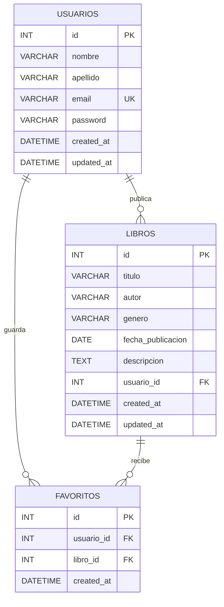

# ERD — BookHub

```mermaid
erDiagram
    USUARIOS ||--o{ LIBROS : publica
    USUARIOS ||--o{ FAVORITOS : guarda
    LIBROS ||--o{ FAVORITOS : recibe

    USUARIOS {
        INT id PK
        VARCHAR nombre
        VARCHAR apellido
        VARCHAR email UK
        VARCHAR password
        DATETIME created_at
        DATETIME updated_at
    }

    LIBROS {
        INT id PK
        VARCHAR titulo
        VARCHAR autor
        VARCHAR genero
        DATE fecha_publicacion
        TEXT descripcion
        INT usuario_id FK
        DATETIME created_at
        DATETIME updated_at
    }

    FAVORITOS {
        INT id PK
        INT usuario_id FK
        INT libro_id FK
        DATETIME created_at
    }
```

`favoritos` resuelve la relación muchos-a-muchos entre usuarios y libros. La restricción única `(usuario_id, libro_id)` evita favoritos duplicados.
