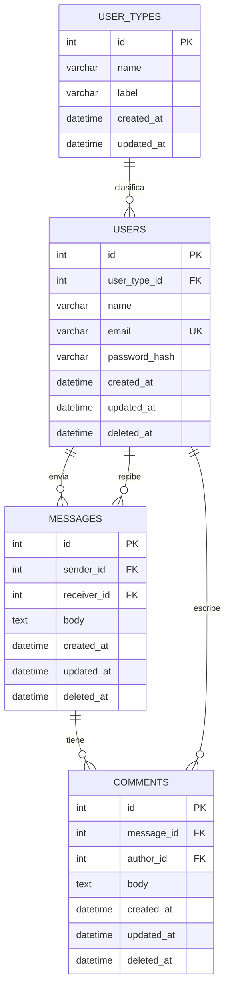

# ERD - Administrador de Datos

Este ERD esta construido solo con los datos visibles en la web estatica:
login, registro, dashboard de usuarios, dashboard de administradores, alta/edicion de usuario, mensajes y comentarios.

## Tablas

### user_types

Representa el campo visible "Tipo Usuario" / "Tipo de Usuario".

| Campo | Tipo | Reglas |
| --- | --- | --- |
| id | INT | Primary key |
| name | VARCHAR(50) | Valor interno: `admin`, `user` |
| label | VARCHAR(100) | Texto visible: `Administrador`, `Usuario` |
| created_at | DATETIME | Fecha de creacion |
| updated_at | DATETIME | Fecha de actualizacion |

### users

Representa los usuarios visibles en login, registro, dashboard, nuevo usuario y editar usuario.

| Campo | Tipo | Reglas |
| --- | --- | --- |
| id | INT | Primary key |
| user_type_id | INT | Foreign key a `user_types.id` |
| name | VARCHAR(100) | Obligatorio |
| email | VARCHAR(255) | Obligatorio, unico |
| password_hash | VARCHAR(255) | Obligatorio; no guardar contrasenas en texto plano |
| created_at | DATETIME | Fecha de creacion |
| updated_at | DATETIME | Fecha de actualizacion |
| deleted_at | DATETIME | Borrado logico para la accion "Borrar" |

### messages

Representa la pantalla "Mensajes a Andrea" y el formulario para enviar mensajes.

| Campo | Tipo | Reglas |
| --- | --- | --- |
| id | INT | Primary key |
| sender_id | INT | Foreign key a `users.id`; usuario que envia |
| receiver_id | INT | Foreign key a `users.id`; usuario que recibe |
| body | TEXT | Contenido del mensaje |
| created_at | DATETIME | Permite mostrar textos como "hace 5 horas" |
| updated_at | DATETIME | Fecha de actualizacion |
| deleted_at | DATETIME | Borrado logico opcional |

### comments

Representa la seccion "Comentarios" dentro de un mensaje.

| Campo | Tipo | Reglas |
| --- | --- | --- |
| id | INT | Primary key |
| message_id | INT | Foreign key a `messages.id` |
| author_id | INT | Foreign key a `users.id`; usuario que comenta |
| body | TEXT | Contenido del comentario |
| created_at | DATETIME | Permite mostrar textos como "hace 1 hora" |
| updated_at | DATETIME | Fecha de actualizacion |
| deleted_at | DATETIME | Borrado logico opcional |

## Datos semilla visibles

### user_types

| id | name | label |
| --- | --- | --- |
| 1 | admin | Administrador |
| 2 | user | Usuario |

### users

| id | name | email | user_type_id |
| --- | --- | --- | --- |
| 1 | Patricia | patricia@codingdojo.com | 1 |
| 2 | Andrea | andrea@codingdojo.com | 2 |
| 3 | Katya | katya@codingdojo.com | 2 |

### messages

| id | sender_id | receiver_id | body | created_at |
| --- | --- | --- | --- | --- |
| 1 | 3 | 2 | lorem ipsum dolor sit amet... | Hace 5 horas en la maqueta |

### comments

| id | message_id | author_id | body | created_at |
| --- | --- | --- | --- | --- |
| 1 | 1 | 1 | lorem ipsum dolor sit amet... | Hace 1 hora en la maqueta |

## Relaciones

- Un tipo de usuario puede tener muchos usuarios.
- Un usuario pertenece a un solo tipo de usuario.
- Un usuario puede enviar muchos mensajes.
- Un usuario puede recibir muchos mensajes.
- Un mensaje puede tener muchos comentarios.
- Un comentario pertenece a un mensaje y a un usuario autor.

